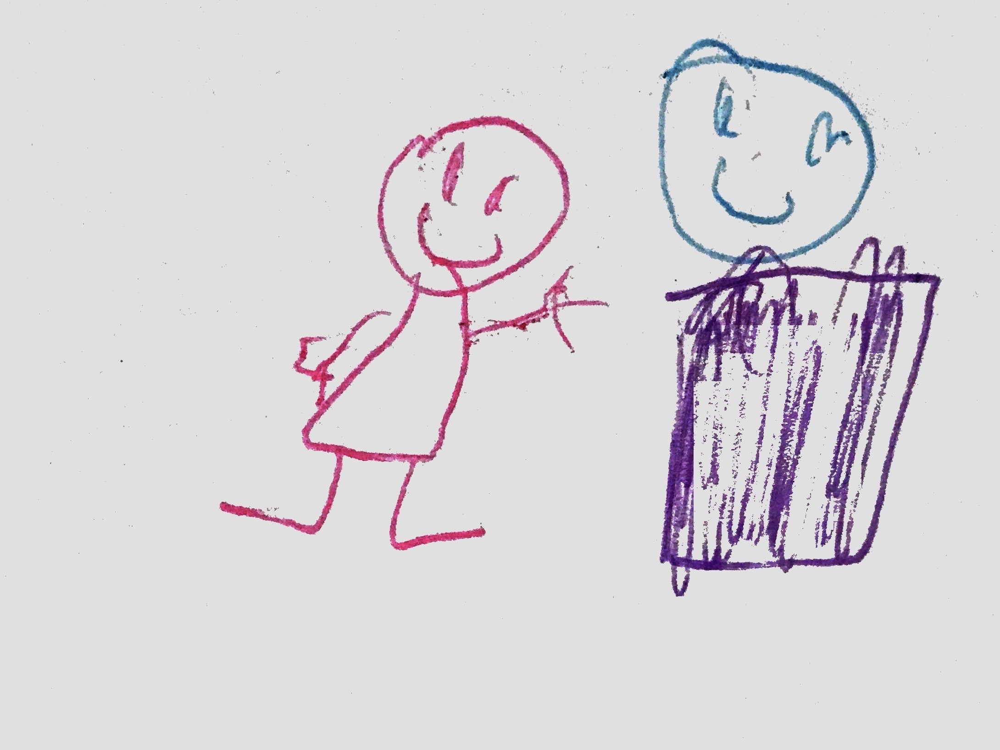

# cloji

`cloji` is my daughter's first program ever! It translates a string into emoji. e.g.,

```clojure
(miawmiaw "teddy")
;=> "🍀👯‍♀️🧚🏻‍♀️🧚🏻‍♀️🌅"
```

She's only 5 ½ year old but I was proud to see she put so much effort to understand the few programming constructs I wanted to teach her.

She typed _all_ the characters in `purple.clj` and came up with all the ~~weird~~ lovely names by herself. The emoji map was the funniest part for her (and the longest part for me ;)

Translating the names of her friends and family was real fun!

---



_My daughter made this drawing when I told her she would be writing her first computer program. I'm so glad that your first program was in Clojure!_

